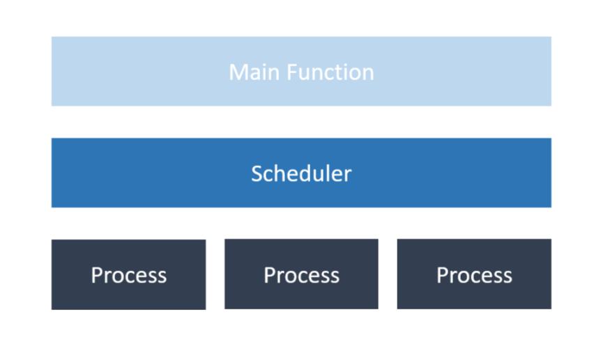
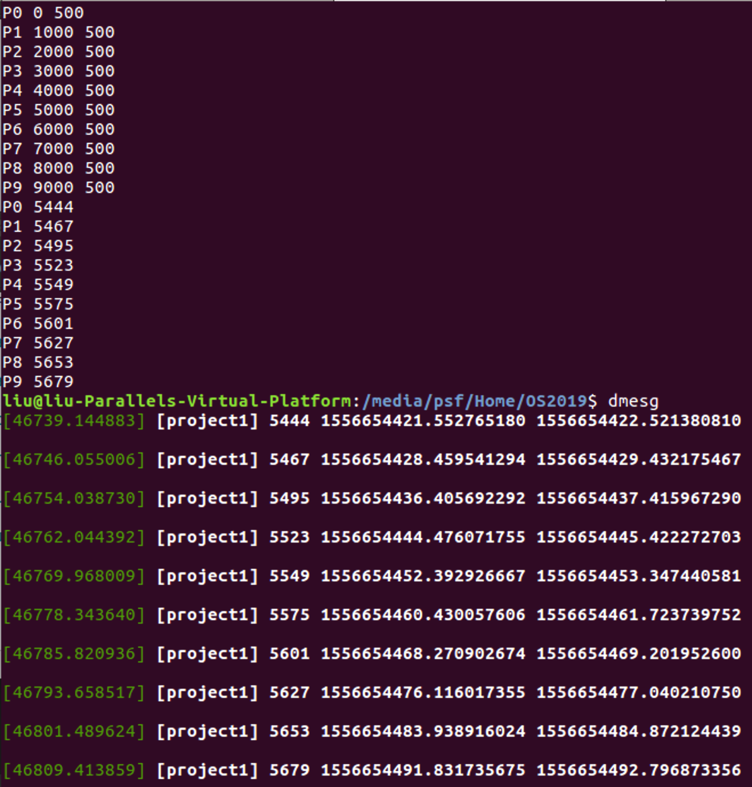
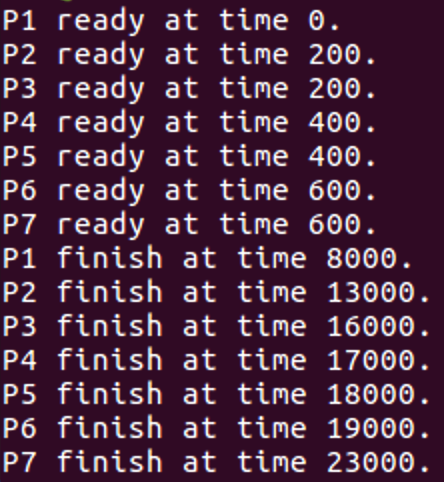
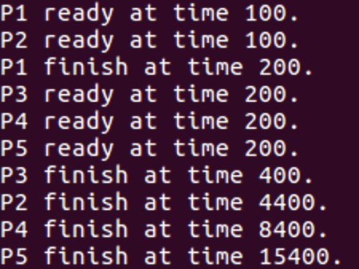
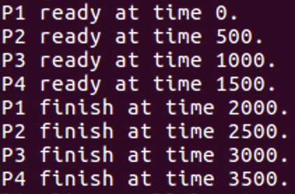
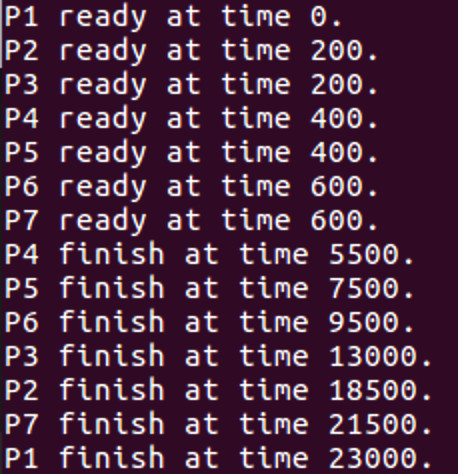

# 2019 OS Project 1 - Scheduling

## Design

### Architecture

在這份Project中 我們透過功能取向 大致分為三個部分:

Main, Process, Scheduler等部分

透過Main呼叫Scheduler來使用對應的演算法排定Process執行順序

再實際呼叫Process模擬程序運作

### Scheduler

Scheduler要做的事情本身還算單純

透過不同的scheduling algorithm 我們可以判斷該 preempt 與否

而不同的 scheduling algorithm 又有自己的比較方法

我們透過 `next_process` 這支函式來分辨不同的Scheduling Algorithm接著會呼叫哪支Process

而Scheduler每個cycle做的事情便是

1. 確定目前狀態 (是否running process仍要執行, 是否仍有process需要被執行)
2. 選取下一個要執行的Process
3. 執行一個 `UNIT_T()`
4. 重新對Process做排序

Scheduler將會重複執行以上的cycle直到沒有其他Process需要被執行

### Process

#### CPU affinity

在整支程式中 我們主要用兩個CPU來完成: Parent, Child

- Parent:
  負責生成, 呼叫, 中斷 Child Process 以及 Log 開始與結束時間進

- Child:
  負責執行程式本身 亦即用for loop執行 `UNIT_T()`

#### Time Log

為了讓dmesg能夠吃到我們餵進去的數字 我們大概想了以下幾種作法

1. 引入 `linux/kernel.h` 的資源 使用別人寫好的function
2. 自己實作 printk 的 system call 加入kernel中 (如同作業一)
3. 利用 `/dev/kmsg` 這個檔案介面 透過直接寫入的方式存取log

以上順序為我們想到以及嘗試的順序 一開始我們打算只接引用別人寫好的function

後來發現並非所有system都預設有這些標頭檔可以引用

因此 打算採取如同作業一的方法 自己實作 printk 的方式來處理

但一來覺得能不動kernel盡量不要動 另一方面則是覺得 可能還有更直覺的做法

因此 透過研究我們發現 `linux/kernel.h` 中的printk正是對 `/dev/kmsg` 進行寫入的動作

所以其實 我們寫入 `/dev/kmsg` 跟實作printk是有異曲同工之妙 

是故我們最後採取此簡單明瞭的做法

## Result

用十個process平均的結果，平均的單位時間為0.0019799022452毫秒

- FIFO_5

  | name | pid  | start time           | end time             |
  | ---- | ---- | -------------------- | -------------------- |
  | P1   | 8191 | 1556655279.385567005 | 1556655294.674265286 |
  | P2   | 8258 | 1556655300.598712782 | 1556655310.752865872 |
  | P3   | 8259 | 1556655300.602706008 | 1556655310.777713299 |
  | P4   | 8269 | 1556655302.930715439 | 1556655313.017893119 |
  | P5   | 8254 | 1556655299.166711482 | 1556655321.011160197 |
  | P6   | 8270 | 1556655302.938712894 | 1556655327.491172516 |
  | P7   | 8253 | 1556655299.159527075 | 1556655328.188369250 |

- PSJF_5.txt

  | name | pid  | start time           | end time             |
  | ---- | ---- | -------------------- | -------------------- |
  | P1   | 9254 | 1556655588.950573115 | 1556655589.145166274 |
  | P3   | 9260 | 1556655589.758839777 | 1556655590.169748569 |
  | P2   | 9255 | 1556655588.970719477 | 1556655601.997773040 |
  | P4   | 9261 | 1556655590.006713540 | 1556655614.761784948 |
  | P5   | 9262 | 1556655589.822806103 | 1556655620.696787530 |

- SJF_5.txt

  | name | pid  | start time           | end time             |
  | ---- | ---- | -------------------- | -------------------- |
  | P1   | 9697 | 1556655721.882408284 | 1556655726.690902163 |
  | P2   | 9726 | 1556655731.343835756 | 1556655732.615682983 |
  | P3   | 9737 | 1556655734.008349740 | 1556655735.050941680 |
  | P4   | 9745 | 1556655736.348366704 | 1556655737.519584408 |

- RR_5.txt

  | name | pid   | start time           | end time             |
  | ---- | ----- | -------------------- | -------------------- |
  | P4   | 10069 | 1556655830.264926553 | 1556655847.623447944 |
  | P5   | 10143 | 1556655850.011625741 | 1556655864.484239824 |
  | P6   | 10151 | 1556655851.822754111 | 1556655872.877290011 |
  | P3   | 10152 | 1556655851.826749200 | 1556655873.225007387 |
  | P2   | 10144 | 1556655850.018971905 | 1556655877.614258916 |
  | P7   | 10207 | 1556655869.670773249 | 1556655879.162375847 |
  | P1   | 10208 | 1556655869.673270308 | 1556655885.763325701 |

## Comparison

- FIFO_5
  - 
  - P1 ready at time 0.
    P2 ready at time 200.
    P3 ready at time 200.
    P4 ready at time 400.
    P5 ready at time 400.
    P6 ready at time 600.
    P7 ready at time 600.
    P1 finish at time 8000.
    P2 finish at time 13000.
    P3 finish at time 16000.
    P4 finish at time 17000.
    P5 finish at time 18000.
    P6 finish at time 19000.
    P7 finish at time 23000.
- PSJF_5

  

- SJF_5

  

- RR_5

  

## Contribution

- B04505021 黃廉弼: 組織架構 檢查程式執行 撰寫報告
- B04505009 劉錫臻: 撰寫Main Function程式碼
- B04505019 唐國霖: 撰寫Process部分程式碼
- B04505024 李昊聰: 協調檔案介面 整理註解
- B04505041 黃博鈞: 撰寫Scheduler部分程式碼

